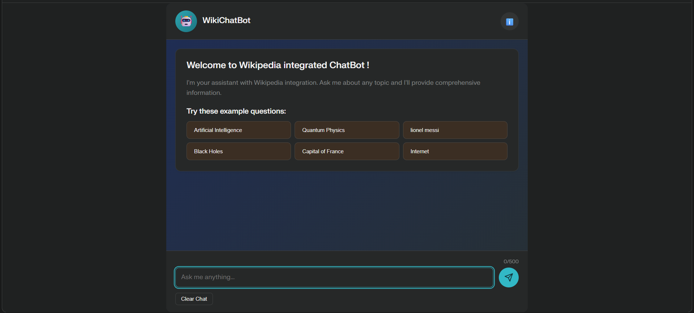
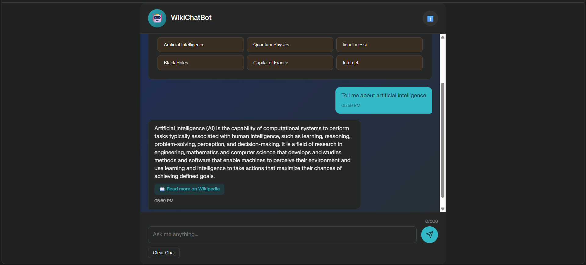

# wikichatbot
This project is a simple chatbot web app built with Python and Flask. It uses an NLTK + Keras model to understand user questions and respond in a chat interface. When needed, it also pulls short summaries from Wikipedia to answer information‑based queries.

## UI

